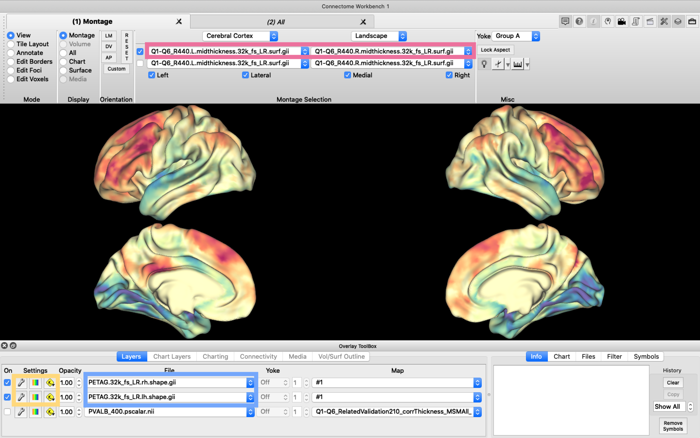

<style type="text/css">
  body{
  font-size: 13pt;
}
</style>


```{r setup, include=TRUE, echo=TRUE}
library(cifti)
library(gifti)

library(ciftiTools)
#set the path to your installation of connectome workbench as 'wb_path'. Connectome workbench can be downloaded here: 
#https://www.humanconnectome.org/software/get-connectome-workbench
ciftiTools.setOption('wb_path', '/Users/valeriesydnor/Software/workbench/')

library(rgl) #to use ciftiTools graphics
rgl::setupKnitr()

setwd("/Users/valeriesydnor/Software/surfaces/surfaces_R_tutorial")
```

# The fslr surface from the Human Connectome Project 

There are multiple different surface spaces, major ones include the fslr surface (HCP), the fsaverage surfaces (freesurfer), and the CIVET surface.

Different cortical surfaces have a different vertex-to-cortical area mappings and use a different number of vertices to represent data on the surface. 

The fslr surface typically contains ~32k vertices per hemisphere (32492, specifically, when including medial wall vertices). BIDS files with the description **space-fsLR_den-91k** contain data in the fslr surface at the 32k resolution. Excluding medial wall vertices, the left hemisphere has exactly 29696 vertices and the right hemisphere has 29716 vertices.

- In the fslr surface (but not fsaverage surfaces) vertex numbers are symmetric across hemispheres (i.e., vertex 100 in both hemispheres corresponds to homologous points on the cortex).
- The fslr surface can be resampled to lower or higher resolutions. For example, neuromaps supports 4k, 8k, 32k, and 164k vertices per hemisphere for the fslr surface.

# Ciftis

Cifti files are files that contain surface (vertex) data for both cortical hemispheres as well as volume (voxel) data for the subcortex and cerebellum. Ciftis use the fslr surface! HCP pipelines use ciftis. 

### Dense versus parcellated ciftis

“Dense” ciftis have data represented at the vertex-level whereas "parcellated" ciftis have data represented for cortical parcels (aka regions, areas, or ROIs).

The dense format (vertex-level data) is indicated by a **d** in the file extension (e.g., dtseries.nii or dscalar.nii) whereas the parcellated format (parcel-level data) is indicated by a **p** in the file extension (e.g., ptseries.nii or pscalar.nii).

### Types of ciftis

Different *types of ciftis* hold different *types of data*   :o

**.dscalar.nii or .pscalar.nii**: contains a scalar map of continuous values for a given metric for all vertices/parcels. Data is therefore frequently a Vx1 vector, although multiple metrics (e.g., T1/T2 ratio, ALFF, cortical thickness) can be stored in different columns.

**.dtseries.nii and .ptseries.nii**: stores series data for every vertex or parcel, for example BOLD timeseries or t1 values at a series of sampling depths along the surface from pia to white matter. Series are stored in a VxT matrix where V is the number of vertices/parcels (rows) and T is the number of points in the series (columns; e.g., TRs or sampling depths).

**.dconn.nii or .pconn.nii**: holds a connectivity matrix that has connectivity values between all vertices/parcels and all other vertices/parcels. Rows and columns represent individual vertices/parcels in the same ordering.

**.dlabel.nii**: represents a surface-based cortical atlas. Every vertex in a dlabel file is assigned a label number. The dlabel file also contains metadata with a label tabel of label keys (label number-to-parcel name key).

# ciftiTools package: Working with dense ciftis in R 

### Reading a dense cifti 

Read in the file

```{r}
CT.dscalar <- ciftiTools::read_cifti("./data/Q1-Q6_RelatedParcellation210.corrThickness_MSMAll_2_d41_WRN_DeDrift.32k_fs_LR.dscalar.nii")
```

Access the data in the file

```{r eval=F, echo=T}
CT.dscalar$data$cortex_left #cortical thickness data for the left cortex is stored here
CT.dscalar$data$cortex_right #cortical thickness data for the right cortex is stored here
```

```{r}
head(CT.dscalar$data$cortex_left) #dscalars are usually a Vx1 vector, with one measure (cortical thickness) for every vertex
```

```{r}
dim(CT.dscalar$data$cortex_left) #there are 29696 non-MW vertices in the left hemisphere, each with 1 metric (cortical thickness) 
```

```{r}
dim(CT.dscalar$data$cortex_right) #there are 29716 non-MW vertices in the right hemisphere, each with 1 metric (cortical thickness) 
```

Save the data to a dataframe in R

```{r}
CT.lefthemisphere <- as.data.frame(CT.dscalar$data$cortex_left)
```

Acess the metadata in the file (#ciftisaremeta)

*Intent*: the type of cifti file
```{r}
#3001 = ConnDense/dconn.nii; 3002 = ConnDenseSeries/dtseries.nii; 3003 = ConnParcels/pconn.nii; 3004 = ConnParcelSries/ptseries.nii; 3006 = ConnDenseScalar/dscalar.nii; 3007 = ConnDenseLabel/.dlabel.nii; 3008 = ConnParcelScalr/pscalar.nii; 3009 = ConnParcelDense/pdconn.nii; 3010 = ConnDenseParcel/dpconn.nii; 3012 = ConnPPSr/pconnseries.nii; 3013 = ConnPPSc/pconnscalar.nii

CT.dscalar$meta$cifti$intent 
```

*Names*: the specific type of data stored in the file 
```{r}
CT.dscalar$meta$cifti$names #name(s) of the measure(s) represented in the data matrix. 
```

*Subcort*: the subcortical data stored in the cifti file (may be blank)
```{r}
CT.dscalar$meta$subcort #if there is subcortical data in your file, you can find information about it here.
#Subcortical levels typically include Cortex-$hemi, Accumbens-$hemi, Amygdala-$hemi, Brain Stem, Caudate-$hemi, Cerebellum-$hemi, Diencephalon-$hemi, Hippocampus-$hemi, Pallidum-$hemi, Putamen-$hemi, Thalamus-$hemi
```

*Medial wall mask*: logical as to whether each left/right hemisphere vertex belongs to the medial wall 

```{r eval=F, echo=T}
CT.dscalar$meta$cortex$medial_wall_mask$left #TRUE/FALSE as to whether each LH vertex belongs to the median wall
CT.dscalar$meta$cortex$medial_wall_mask$right #TRUE/FALSE as to whether each RH vertex belongs to the median wall
```

```{r}
head(CT.dscalar$meta$cortex$medial_wall_mask$left, 30)
```

### Types of dense ciftis

**dscalar**

```{r}
head(CT.dscalar$data$cortex_left) #a vector
```

**dtseries**

```{r}
BOLD.dtseries <- ciftiTools::read_cifti("./data/sub-2925300630_ses-PNC1_task-rest_acq-singleband_space-fsLR_den-91k_desc-residual_bold.dtseries.nii") #processed BOLD timeseries output by xcp
```

```{r}
dim(BOLD.dtseries$data$cortex_left) #29696 vertices by 124 TRs
```

```{r}
BOLD.dtseries$data$cortex_left[1:10,1:6] #we can treat this like a matrix
```

**dlabel**

```{r}
Glasser306.dlabel <- ciftiTools::read_cifti("./data/glasser_space-fsLR_den-32k_desc-atlas.dlabel.nii") #glasser surface atlas, 360 parcels
```

```{r}
Glasser306.dlabel$data$cortex_right[1:30] #every vertex is assigned to a label number
```

```{r}
Glasser306.dlabel$meta$cifti$labels$INDEXMAX[1:20,] #label tabel, label number to parcel name key!
```

### Visualizing a dense cifti 

Basic visualization 

```{r, message=F, warning=F}
view_cifti_surface(xifti = CT.dscalar, widget = TRUE) #widget = TRUE allows you to see the brain data in your Rmarkdown, instead of it popping up in a separate window
```

Changing the surf file for visualization

* You can visualize your surface data on different surface geometries including inflated, spherical, midthickness, etc. surfaces. This essentially means the same vertex data can be projected to different looking surfaces.
* This requires changing the "surf" file associated with your cifti. Surf files have the extension **surf.gii**. Surf files come in pairs, one for the left hemisphere and one for the right hemisphere.

```{r}
surf.lh.midthickness <- read_surf("/Users/valeriesydnor/Software/surfaces/surfaces_R_tutorial/surfs/Q1-Q6_R440.L.midthickness.32k_fs_LR.surf.gii") #read in left hemisphere midthickness surf
surf.rh.midthickness <- read_surf("/Users/valeriesydnor/Software/surfaces/surfaces_R_tutorial/surfs/Q1-Q6_R440.R.midthickness.32k_fs_LR.surf.gii") #read in right hemisphere midthickness surf

CT.dscalar <- add_surf(CT.dscalar, surfL = surf.lh.midthickness, surfR = surf.rh.midthickness) #assign these new surfs to our CT.dscalar cifti

view_cifti_surface(xifti = CT.dscalar, widget = TRUE, colors=c("magma"), zlim=c(1.8,3.2)) 
```

Visualizing series data (idx)

```{r}
surf.lh.sphere <- read_surf("/Users/valeriesydnor/Software/surfaces/surfaces_R_tutorial/surfs/L.sphere.32k_fs_LR.surf.gii") #read in left hemisphere sphere surf
surf.rh.sphere <- read_surf("/Users/valeriesydnor/Software/surfaces/surfaces_R_tutorial/surfs/R.sphere.32k_fs_LR.surf.gii") #read in right hemisphere sphere surf

BOLD.dtseries <- add_surf(BOLD.dtseries, surfL = surf.lh.sphere, surfR = surf.rh.sphere) #assign these new surfs to our BOLD timeseries data

view_cifti_surface(xifti = BOLD.dtseries, idx=c(2:5), color_mode = "diverging", colors = c("RdYlBu"), zlim = c(-4,4), widget = TRUE) #lets view our timeseries data. idx lets you decide which series (columns) of data to view, colors lets you change the colors, zlim lets you set the color bar limits
```

### Writing a dense cifti

Manipulate some cifti data

```{r}
plot(CT.dscalar$data$cortex_left)
#arbitrarily divide CT data into low (0) and high (1) thickness, changing the values stored in CT.dscalar$data
CT.dscalar$data$cortex_left[CT.dscalar$data$cortex_left < 2.6 ] <- 0
CT.dscalar$data$cortex_left[CT.dscalar$data$cortex_left >= 2.6 ] <- 1
plot(CT.dscalar$data$cortex_left) 

CT.dscalar$data$cortex_right[CT.dscalar$data$cortex_right < 2.6 ] <- 0
CT.dscalar$data$cortex_right[CT.dscalar$data$cortex_right >= 2.6 ] <- 1
```

Save the cifti

```{r, message=F, warning=F}
write_cifti(xifti = CT.dscalar, cifti_fname = "./data/CT.binarized.dscalar.nii")
CT.binarized <- read_cifti("./data/CT.binarized.dscalar.nii")
CT.binarized <- add_surf(CT.binarized, surfL = surf.lh.midthickness, surfR = surf.rh.midthickness)
view_cifti(CT.binarized, colors = c("PuBu"), widget = TRUE)
```

```{bash, echo=T, eval=T}
rm ./data/CT.binarized.dscalar.nii
```

Create a new cifti 

* You can make a cifti from scratches if you have 1) data for all left and right hemisphere vertices and 2) files indicating which vertices are the medial wall.
* Make sure to save your cifti with the correct file extension and intent!

```{r}
vertexdata.lefthemisphere <-  runif(29696) #random values for all LH vertices
vertexdata.righthemisphere <-  runif(29716) #random values for all RH vertices
```

```{r}
medialwall.mask.leftcortex <- read.csv("./medialwall/medialwall.mask.leftcortex.csv", header = F, colClasses = c("logical")) #left cortex medial wall mask
medialwall.mask.rightcortex <-read.csv("./medialwall/medialwall.mask.rightcortex.csv", header = F, colClasses = c("logical")) #left cortex medial wall mask

head(medialwall.mask.leftcortex, 10) #TRUE/FALSE as to whether each LH vertex belongs to the medial wall
```

```{r}
setequal(medialwall.mask.leftcortex$V1, CT.dscalar$meta$cortex$medial_wall_mask$left) #our csv file matches what is expected based on this dscalar
setequal(medialwall.mask.rightcortex$V1, BOLD.dtseries$meta$cortex$medial_wall_mask$right)  #our csv file matches what is expected based on this dtseries
```

```{r}
unicorn.dscalar <- as_cifti(cortexL = vertexdata.lefthemisphere, cortexL_mwall = medialwall.mask.leftcortex$V1, cortexR = vertexdata.righthemisphere, cortexR_mwall = medialwall.mask.rightcortex$V1) #put our vertex data and medial wall information into a cifti format

unicorn.dscalar$meta$cifti$intent <- "3006" #set the intent
```

```{r, message=F, warning=F}
view_cifti(unicorn.dscalar, colors = c("magma"), widget = TRUE)
write_cifti(xifti = unicorn.dscalar, cifti_fname = "./data/unicorn.dscalar.nii")
```

```{bash, echo=T, eval=T}
rm ./data/unicorn.dscalar.nii
```

# cifti package: Working with parcellated ciftis in R 

*ciftiTools only works with dense ciftis. For parcellated ciftis, we can use the cifti package, though it is missing some of the functionality included in ciftiTools (writing, visualization)*

### Reading a parcellated cifti 

Read in the file

```{r, message=F, warning=F}
ALFF.pscalar <- cifti::read_cifti("./data/sub-2925300630_fsLR_alff_glasser360.pscalar.nii") #wow ALFF is such a cool measure #ALFF is back baby
```

Access the data in the file

```{r}
length(ALFF.pscalar$data) #data for all (here, 360) parcels is contained in pscalar$data. Data is not longer separated by hemisphere
```

```{r}
ALFF.pscalar$data[1:20] #scalar values for the first 20 parcels
```

See what parcel labels correspond to each row of pscalar$data

```{r}
names(ALFF.pscalar$Parcel)[1:20] #here is the parcel order key
```

See what vertices belong to a given parcel

```{r}
ALFF.pscalar$Parcel$R_V1_ROI[[1]][1:20] #first 20 vertices (of 787) that correspond to the right hemisphere V1 parcel
```

```{r}
ALFF.pscalar$Parcel$L_V1_ROI[[1]][1:20] #left and right hemisphere vertices are symmetric!
```

Save the data to a dataframe in R

```{r}
ALFF.sub.df <- as.data.frame(ALFF.pscalar$data)
colnames(ALFF.sub.df) <- c("mean.ALFF")
ALFF.sub.df$parcel <- names(ALFF.pscalar$Parcel)
```

### Types of parcellated ciftis

**pscalar**

```{r}
head(ALFF.pscalar$data) #a numeric vector
```

**pconn**

```{r, message=F, warning=F}
FC.pconn <- cifti::read_cifti("./data/sub-2925300630_ses-PNC1_task-rest_acq-singleband_space-fsLR_atlas-Glasser_den-91k_bold.pconn.nii")
```

```{r}
dim(FC.pconn$data) #a 360 by 360 matrix of functional connectivity
```

```{r}
FC.pconn$data[1:10,1:6]
```

### Visualizing a parcellated cifti: ggseg

```{r}
library(ggseg)
```

I like to use ggseg to visualize parcellated data on the cortical surface. The original ggseg package can visualize freesurfer atlas data (e.g. Desikan atlas), but there are many extensions (see here: https://github.com/ggseg/ggsegExtra) including ggsegGlasser, ggsegSchaefer, ggsegGordon, ggsegEconomo, ggsegBrodmann, ggsegPower, etc. So fun! 

* ggseg can be used to visualize parcel data regardless of which surface coordinate system/resolution your analysis originally took place in 
* As demonstrated below, to plot your parcellated data with a ggseg package, you need to have the correct parcel naming convention that matches the parcel names in `ggseg$atlas::$atlas$data$label` (or, sometimes, `ggseg$atlas::$atlas$data$annot`)

Visualize data in Glaser360 parcels

```{r}
ggsegGlasser::glasser$data$label[199:205] #you need a label column in your df that matches this label format
```

```{r}
ALFF.sub.df$parcel[1:6] #the parcel names from our pscalar file, parcellated with the glasser surface atlas in XCP, don't exactly match those above!
```

```{r}
#transform the original parcel names to the ggseg label format
ALFF.sub.df$label[1:180] <- sprintf("rh_%s", gsub('.{4}$', '', ALFF.sub.df$parcel[1:180])) 
ALFF.sub.df$label[181:360] <- sprintf("lh_%s", gsub('.{4}$', '', ALFF.sub.df$parcel[181:360])) 
ALFF.sub.df$label[1:6] 
```

```{r, message=F, warning=F}
library(ggsegGlasser)
ggseg(.data = ALFF.sub.df, atlas = "glasser", mapping=aes(fill = mean.ALFF), position = c("stacked")) + paletteer::scale_fill_paletteer_c("pals::ocean.matter", direction = -1) 
```

Visualize data in Schaefer400 parcels 

```{r, message=F, warning=F}
SA.schaefer.pscalar <- cifti::read_cifti("./data/SensorimotorAssociation.Axis.Schaefer400.17Networks.pscalar.nii") #read in some data in schaefer400 parcels
```

```{r}
#put parcellated data from pscalar file into a df
SA.schaefer.df <- as.data.frame(scale(SA.schaefer.pscalar$data, center=T, scale =T))
colnames(SA.schaefer.df) <- c("SA.axis")
SA.schaefer.df$parcel <- names(SA.schaefer.pscalar$Parcel)
```

```{r}
ggsegSchaefer::schaefer17_400$data$label[161:166] #you need a label column in your df that matches this label format
```

```{r}
SA.schaefer.df$parcel[82:86] #the parcel names from our pscalar file, parcellated with the scahefer surface atlas in XCP, don't exactly match those above!
```

```{r}
#transform the original parcel names to the ggseg label format
SA.schaefer.df$label[1:200] <- sprintf("lh_%s", SA.schaefer.df$parcel[1:200])
SA.schaefer.df$label[201:400] <- sprintf("rh_%s", SA.schaefer.df$parcel[201:400])
```

```{r, message=F, warning=F}
library(ggsegSchaefer)
ggseg(.data = SA.schaefer.df, atlas = "schaefer17_400", mapping=aes(fill=SA.axis), position=c("stacked")) + theme_void() +  scale_fill_gradient2(low= "goldenrod1", mid = "white", high = "#6f1282", guide = "colourbar", aesthetics = "fill", name = NULL) + theme(legend.position = "none")
```

# Giftis

Gifti files are files that contain surface (vertex) data for one cortical hemisphere; gifti files usually come in paris (left and right hemisphere)! 

fslr, fsaverage, and civet surfaces use gifti files.

### Types of giftis

Different *types of giftis* hold different *types of data*, too

**.func.gii or .shape.gii**: contains a scalar map of continuous values for a given metric for all left or right hemisphere vertices (similar to a dscalar). The file format is identical for func and shape, the use of one extension or the other is by choice/convention to indicate functional or structural data.

**label.gii**: encodes label numbers at each vertex for one cortical hemisphere. Additionally, the file contains a table of a parcel names and a color for each label number, known as a label table (similar to a dlabel).

**surf.gii**: a geometry file that maps vertices to a specific part of a reconstructured surface. Contain only the coordinate and triangle arrays.

# gifti package: Working with giftis in R

### Reading a gifti

Read in the file

```{r}
CBF.lh <- read_gifti("./data/cbf.32k_fs_LR.lh.shape.gii") 
CBF.rh <- read_gifti("./data/cbf.32k_fs_LR.rh.shape.gii") 
```

Access the data in the file

```{r eval=F, echo=T}
CBF.lh$data$normal #CBF data for the left cortex is stored here
CBF.rh$data$normal #CBF data for the right cortex is stored here
```

```{r}
head(CBF.lh$data$normal) #a Vx1 vector, with one measure (CBF) for every vertex
```

```{r}
dim(CBF.lh$data$normal) #there are 32492 vertices in the left hemisphere, including the medial wall
```


# Connectome Workbench 

The workbench software comes with Workbench Command, a set of command line tools that can be used to perform operations on ciftis, giftis, and volume data. Peruse all the available functions here https://www.humanconnectome.org/software/workbench-command 

We can also run workbench commands in R, using the ciftiTools package. Here are examples of useful commands.

### Parcellate a dense cifti with a dlabel file

```{r}
command = sprintf("-cifti-parcellate ./data/Q1-Q6_RelatedParcellation210.corrThickness_MSMAll_2_d41_WRN_DeDrift.32k_fs_LR.dscalar.nii ./data/glasser_space-fsLR_den-32k_desc-atlas.dlabel.nii COLUMN ./data/fsLR_corrThickness_glasser360.pscalar.nii") #dense cifti, dlabel, COLUMN, parcellated cifti

ciftiTools::run_wb_cmd(command, intern = FALSE, ignore.stdout = NULL, ignore.stderr = NULL)
```

```{r, message=F, warning=F}
library(scales)
CT.pscalar <- cifti::read_cifti("./data/fsLR_corrThickness_glasser360.pscalar.nii")
CT.df <- as.data.frame(CT.pscalar$data)
colnames(CT.df) <- c("CT")
CT.df$label <- ALFF.sub.df$label

ggseg(.data = CT.df, atlas = "glasser", mapping=aes(fill = CT), position = c("stacked")) + paletteer::scale_fill_paletteer_c("harrypotter::lunalovegood", limits = c(2,3.3), oob=squish)
```

```{bash, echo=T, eval=T}
rm ./data/fsLR_corrThickness_glasser360.pscalar.nii
```


### Separate a cifti into left and right cortex giftis

```{r}
command = sprintf("-cifti-separate ./data/Q1-Q6_RelatedParcellation210.corrThickness_MSMAll_2_d41_WRN_DeDrift.32k_fs_LR.dscalar.nii COLUMN -metric CORTEX_LEFT ./data/fsLR_den-32k_hemi-L_desc-corrThickness.shape.gii -metric CORTEX_RIGHT ./data/fsLR_den-32k_hemi-R_desc-corrThickness.shape.gii") #dense cifti, COLUMN, -metric CORTEX_LEFT, left hemisphere gifti, -metrix CORTEX_RIGHT, right hemisphere gifti
                  
ciftiTools::run_wb_cmd(command, intern = FALSE, ignore.stdout = NULL, ignore.stderr = NULL)
```

```{bash, echo=T, eval=T}
rm ./data/fsLR_den-32k_hemi-*_desc-corrThickness.shape.gii
```


### Resample your data from the fslr surface to an fsaverage surface

Resample left hemisphere fslr gifti to fsaverage5

```{r}
command = sprintf("-metric-resample ./data/SensorimotorAssociation_Axis_LH.fslr32k.func.gii ./fslr_to_fsaverage/fs_LR-deformed_to-fsaverage.L.sphere.32k_fs_LR.surf.gii ./fslr_to_fsaverage/fsaverage5_std_sphere.L.10k_fsavg_L.surf.gii ADAP_BARY_AREA ./data/SensorimotorAssociation_Axis_LH.fsaverage5.func.gii -area-metrics ./fslr_to_fsaverage/fs_LR.L.midthickness_va_avg.32k_fs_LR.shape.gii ./fslr_to_fsaverage/fsaverage5.L.midthickness_va_avg.10k_fsavg_L.shape.gii")

ciftiTools::run_wb_cmd(command, intern = FALSE, ignore.stdout = NULL, ignore.stderr = NULL)
```

Resample right hemisphere fslr gifti to fsaverage4

```{r}
command = sprintf("-metric-resample ./data/SensorimotorAssociation_Axis_RH.fslr32k.func.gii ./fslr_to_fsaverage/fs_LR-deformed_to-fsaverage.R.sphere.32k_fs_LR.surf.gii ./fslr_to_fsaverage/fsaverage4_std_sphere.R.3k_fsavg_R.surf.gii ADAP_BARY_AREA ./data/SensorimotorAssociation_Axis_RH.fsaverage4.func.gii -area-metrics ./fslr_to_fsaverage/fs_LR.R.midthickness_va_avg.32k_fs_LR.shape.gii ./fslr_to_fsaverage/fsaverage4.R.midthickness_va_avg.3k_fsavg_R.shape.gii")

ciftiTools::run_wb_cmd(command, intern = FALSE, ignore.stdout = NULL, ignore.stderr = NULL)
```

```{bash, echo=T, eval=T}
rm ./data/SensorimotorAssociation_Axis_LH.fsaverage5.func.gii
rm ./data/SensorimotorAssociation_Axis_RH.fsaverage4.func.gii
```

### Project MNI data to the surface for visualization 

Map MNI volume data to left and right cortical surfaces

```{r}
#left hemisphere
command=sprintf("-volume-to-surface-mapping ./data/RewardAtlas-TotalNetwork-pos_or_neg-mask-MNI.nii.gz ./surfs/Q1-Q6_R440.L.midthickness.32k_fs_LR.surf.gii ./data/RewardAtlas-LH-surf.func.gii -trilinear")
ciftiTools::run_wb_cmd(command, intern = FALSE, ignore.stdout = NULL, ignore.stderr = NULL)

#right hemisphere
command=sprintf("-volume-to-surface-mapping ./data/RewardAtlas-TotalNetwork-pos_or_neg-mask-MNI.nii.gz ./surfs/Q1-Q6_R440.R.midthickness.32k_fs_LR.surf.gii ./data/RewardAtlas-RH-surf.func.gii -trilinear")
ciftiTools::run_wb_cmd(command, intern = FALSE, ignore.stdout = NULL, ignore.stderr = NULL)
```

Read in your surface giftis

```{r}
reward_lh.gifti <- read_gifti("./data/RewardAtlas-LH-surf.func.gii")
reward_rh.gifti <- read_gifti("./data/RewardAtlas-RH-surf.func.gii")
```

Combine your giftis into one cifti surface (for visualization with ciftiTools)

```{r}
reward.atlas.cifti <- as_cifti(cortexL = reward_lh.gifti$data$normal, cortexR = reward_rh.gifti$data$normal)

reward.atlas.cifti <- add_surf(reward.atlas.cifti, surfL=surf.lh.midthickness, surfR=surf.rh.midthickness)
```

Visualize!

```{r, message=F, warning=F} 
view_cifti(reward.atlas.cifti, colors=c("PuBu"), widget=TRUE)
```

# Workbench Viewer

The Connectome Workbench viewer (wb_view) is excellent for visualizing dense ciftis, parcellated ciftis, and giftis outside of R.

To use wb_view you must load both a surface geometry file (surf.gii) and your data file.

In the image below:

- Pink box is where loaded surf.gii files appear.
- Blue box is where your data file will appear.
- Yellow box is where you can change visualization settings.

```{r figurename, echo=FALSE, fig.cap="This is the basic layout of Workbench Viewer", out.width = '90%'}

```